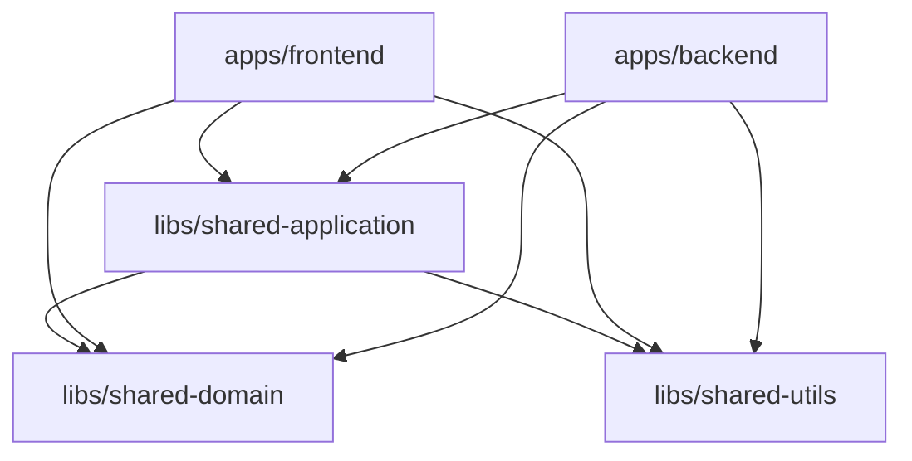
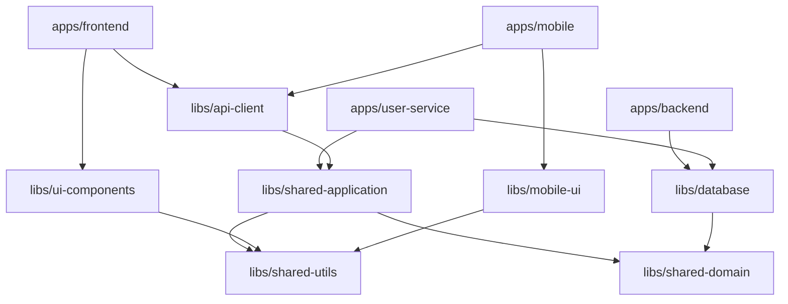

# Nx Target Structure Design

## Overview

This document details the target Nx monorepo structure, library organization, dependency management, and architectural decisions for the migrated codebase.

## Workspace Configuration

### Root Level Files
```
task-app-nx/
├── nx.json                         # Nx workspace configuration
├── package.json                    # Unified dependencies
├── workspace.json                  # Project definitions
├── tsconfig.base.json              # Shared TypeScript config
├── .eslintrc.json                  # Shared linting rules
├── prettier.config.js              # Code formatting
├── vitest.workspace.ts             # Unified testing config
└── README.md                       # Workspace documentation
```

### Core Directory Structure
```
task-app-nx/
├── apps/                           # Runnable applications
├── libs/                           # Shared libraries  
├── tools/                          # Build tools & generators
├── docs/                           # Documentation
└── dist/                           # Build outputs
```

## Applications (`apps/`)

### Frontend Application
```
apps/frontend/
├── project.json                    # Nx project configuration
├── vite.config.ts                  # Vite configuration
├── tsconfig.json                   # App-specific TypeScript config
├── index.html                      # Entry HTML
├── src/
│   ├── main.tsx                    # React entry point
│   ├── App.tsx                     # Root component
│   ├── presentation/               # UI layer (Clean Architecture)
│   │   ├── components/
│   │   │   ├── common/             # Shared UI components
│   │   │   └── ui/                 # Base UI components (shadcn/ui)
│   │   ├── features/
│   │   │   └── todo/               # Feature-specific components
│   │   │       ├── components/
│   │   │       ├── pages/
│   │   │       └── view-models/
│   │   └── layout/                 # Layout components
│   ├── infrastructure/             # Infrastructure layer
│   │   ├── api/                    # HTTP clients
│   │   ├── persistence/            # Local storage, IndexedDB
│   │   ├── state/                  # Zustand stores
│   │   └── di/                     # Dependency injection container
│   └── assets/                     # Static assets
└── public/                         # Public assets
```

**Key Dependencies:**
- `@task-app/shared-domain`
- `@task-app/shared-application`
- `@task-app/shared-utils`

### Backend Application
```
apps/backend/
├── project.json                    # Nx project configuration
├── tsconfig.json                   # App-specific TypeScript config
├── src/
│   ├── main.ts                     # Express entry point
│   ├── config/                     # App configuration
│   ├── presentation/               # Presentation layer (Clean Architecture)
│   │   ├── controllers/            # Express controllers
│   │   ├── routes/                 # Route definitions
│   │   ├── middleware/             # Express middleware
│   │   └── dto/                    # API-specific DTOs
│   ├── infrastructure/             # Infrastructure layer
│   │   ├── persistence/            # Database repositories
│   │   │   ├── typeorm/
│   │   │   ├── sequelize/
│   │   │   ├── mongoose/
│   │   │   └── prisma/
│   │   ├── external-services/      # Third-party integrations
│   │   └── di/                     # Dependency injection container
│   └── shared/                     # Backend-specific utilities
│       └── middleware/
├── prisma/                         # Database schema
└── tests/                          # Integration tests
    └── api.integration.spec.ts
```

**Key Dependencies:**
- `@task-app/shared-domain`
- `@task-app/shared-application`
- `@task-app/shared-utils`

## Shared Libraries (`libs/`)

### 1. Shared Domain (`libs/shared-domain`)

**Purpose:** Pure domain logic following Domain-Driven Design principles

```
libs/shared-domain/
├── project.json
├── tsconfig.json
├── src/
│   ├── index.ts                    # Public API exports
│   ├── entities/                   # Domain entities
│   │   ├── Todo.ts
│   │   └── index.ts
│   ├── value-objects/              # Value objects
│   │   ├── TodoId.ts
│   │   ├── TodoTitle.ts
│   │   ├── TodoPriority.ts
│   │   └── index.ts
│   ├── exceptions/                 # Domain exceptions
│   │   ├── DomainExceptions.ts
│   │   └── index.ts
│   ├── services/                   # Domain services
│   │   ├── TodoDomainService.ts
│   │   └── index.ts
│   ├── specifications/             # Business rules
│   │   ├── TodoSpecifications.ts
│   │   └── index.ts
│   └── events/                     # Domain events
│       ├── TodoEvents.ts
│       └── index.ts
└── README.md                       # Library documentation
```

**Dependencies:** None (pure domain logic)
**Consumers:** All applications and shared-application library

### 2. Shared Application (`libs/shared-application`)

**Purpose:** Application layer use cases, DTOs, and business orchestration

```
libs/shared-application/
├── project.json
├── tsconfig.json
├── src/
│   ├── index.ts                    # Public API exports
│   ├── dto/                        # Data Transfer Objects
│   │   ├── TodoCommands.ts
│   │   ├── TodoQueries.ts
│   │   ├── TodoDto.ts
│   │   └── index.ts
│   ├── use-cases/                  # Application use cases
│   │   ├── commands/
│   │   │   ├── CreateTodoUseCase.ts
│   │   │   ├── UpdateTodoUseCase.ts
│   │   │   ├── DeleteTodoUseCase.ts
│   │   │   ├── ToggleTodoUseCase.ts
│   │   │   └── index.ts
│   │   ├── queries/
│   │   │   ├── TodoQueryHandlers.ts
│   │   │   └── index.ts
│   │   └── index.ts
│   ├── mappers/                    # Object mappers
│   │   ├── TodoMapper.ts
│   │   └── index.ts
│   ├── interfaces/                 # Application interfaces
│   │   ├── ITodoRepository.ts
│   │   ├── ITodoService.ts
│   │   └── index.ts
│   └── services/                   # Application services
│       ├── TodoCommandService.ts
│       ├── TodoQueryService.ts
│       └── index.ts
└── README.md
```

**Dependencies:** 
- `@task-app/shared-domain`
- `@task-app/shared-utils`

**Consumers:** All applications

### 3. Shared Utils (`libs/shared-utils`)

**Purpose:** Common utilities and helper functions

```
libs/shared-utils/
├── project.json
├── tsconfig.json
├── src/
│   ├── index.ts                    # Public API exports
│   ├── uuid.ts                     # UUID generation
│   ├── validation.ts               # Validation helpers
│   ├── date.ts                     # Date utilities
│   ├── types.ts                    # Common TypeScript types
│   └── constants.ts                # Application constants
└── README.md
```

**Dependencies:** None
**Consumers:** All libraries and applications

## Future Libraries (Phase 2)

### UI Components Library (`libs/ui-components`)
```
libs/ui-components/
├── src/
│   ├── components/                 # Reusable React components
│   ├── hooks/                      # Custom React hooks  
│   ├── utils/                      # UI utilities
│   └── styles/                     # Shared styles
```

### Mobile UI Library (`libs/mobile-ui`)
```
libs/mobile-ui/
├── src/
│   ├── components/                 # React Native components
│   ├── navigation/                 # Navigation utilities
│   └── styles/                     # Mobile-specific styles
```

### API Client Library (`libs/api-client`)
```
libs/api-client/
├── src/
│   ├── clients/                    # HTTP clients
│   ├── types/                      # API response types
│   └── interceptors/               # Request/response interceptors
```

### Database Library (`libs/database`)
```
libs/database/
├── src/
│   ├── schemas/                    # Database schemas
│   ├── migrations/                 # Database migrations
│   └── seeds/                      # Test data
```

### Authentication Library (`libs/auth`)
```
libs/auth/
├── src/
│   ├── strategies/                 # Auth strategies (JWT, OAuth)
│   ├── guards/                     # Route guards
│   └── middleware/                 # Auth middleware
```

### Messaging Library (`libs/messaging`)
```
libs/messaging/
├── src/
│   ├── events/                     # Event definitions
│   ├── handlers/                   # Event handlers
│   └── queues/                     # Queue implementations
```

## Dependency Graph

### Phase 1 Dependencies


### Phase 2 Extended Dependencies


## TypeScript Configuration

### Base Configuration (`tsconfig.base.json`)
```json
{
  "compilerOptions": {
    "target": "ES2022",
    "module": "ESNext",
    "moduleResolution": "node",
    "allowSyntheticDefaultImports": true,
    "esModuleInterop": true,
    "experimentalDecorators": true,
    "emitDecoratorMetadata": true,
    "strict": true,
    "baseUrl": ".",
    "paths": {
      "@task-app/shared-domain": ["libs/shared-domain/src/index.ts"],
      "@task-app/shared-application": ["libs/shared-application/src/index.ts"],
      "@task-app/shared-utils": ["libs/shared-utils/src/index.ts"],
      "@task-app/ui-components": ["libs/ui-components/src/index.ts"],
      "@task-app/mobile-ui": ["libs/mobile-ui/src/index.ts"],
      "@task-app/api-client": ["libs/api-client/src/index.ts"],
      "@task-app/database": ["libs/database/src/index.ts"],
      "@task-app/auth": ["libs/auth/src/index.ts"],
      "@task-app/messaging": ["libs/messaging/src/index.ts"]
    }
  }
}
```

## Nx Project Configuration

### Library Project Configuration Template
```json
{
  "name": "shared-domain",
  "$schema": "../../node_modules/nx/schemas/project-schema.json",
  "projectType": "library",
  "sourceRoot": "libs/shared-domain/src",
  "targets": {
    "build": {
      "executor": "@nx/js:tsc",
      "outputs": ["{options.outputPath}"],
      "options": {
        "outputPath": "dist/libs/shared-domain",
        "main": "libs/shared-domain/src/index.ts",
        "tsConfig": "libs/shared-domain/tsconfig.lib.json"
      }
    },
    "test": {
      "executor": "@nx/vite:test",
      "outputs": ["{options.reportsDirectory}"],
      "options": {
        "passWithNoTests": true,
        "reportsDirectory": "../../coverage/libs/shared-domain"
      }
    },
    "lint": {
      "executor": "@nx/eslint:lint",
      "outputs": ["{options.outputFile}"],
      "options": {
        "lintFilePatterns": ["libs/shared-domain/**/*.ts"]
      }
    }
  },
  "tags": ["type:domain", "scope:shared"]
}
```

### Application Project Configuration Template
```json
{
  "name": "frontend",
  "$schema": "../../node_modules/nx/schemas/project-schema.json",
  "projectType": "application",
  "sourceRoot": "apps/frontend/src",
  "targets": {
    "build": {
      "executor": "@nx/vite:build",
      "outputs": ["{options.outputPath}"],
      "options": {
        "outputPath": "dist/apps/frontend"
      }
    },
    "serve": {
      "executor": "@nx/vite:dev-server",
      "options": {
        "buildTarget": "frontend:build"
      }
    },
    "test": {
      "executor": "@nx/vite:test",
      "outputs": ["{options.reportsDirectory}"],
      "options": {
        "passWithNoTests": true,
        "reportsDirectory": "../../coverage/apps/frontend"
      }
    },
    "lint": {
      "executor": "@nx/eslint:lint",
      "outputs": ["{options.outputFile}"],
      "options": {
        "lintFilePatterns": ["apps/frontend/**/*.{ts,tsx}"]
      }
    }
  },
  "tags": ["type:app", "scope:frontend"]
}
```

## Build Strategy

### Build Targets and Dependencies
```json
{
  "targetDefaults": {
    "build": {
      "dependsOn": ["^build"]
    },
    "test": {
      "dependsOn": ["^build"]
    }
  }
}
```

### Parallel Execution
- **Libraries build first** (shared-domain → shared-application → shared-utils)
- **Applications build after** dependencies are ready
- **Tests run in parallel** across all projects
- **Linting runs in parallel** across all projects

## Development Workflow

### Common Commands
```bash
# Start all applications
nx run-many --target=serve --projects=frontend,backend

# Build everything
nx run-many --target=build --all

# Test everything  
nx run-many --target=test --all

# Lint everything
nx run-many --target=lint --all

# Build only what changed
nx affected:build

# Test only what changed
nx affected:test
```

### Dependency Enforcement
Nx enforces library boundaries through ESLint rules:
```json
{
  "rules": {
    "@nx/enforce-module-boundaries": [
      "error",
      {
        "allow": [],
        "depConstraints": [
          {
            "sourceTag": "type:app",
            "onlyDependOnLibsWithTags": ["type:domain", "type:application", "type:util"]
          },
          {
            "sourceTag": "type:domain",
            "onlyDependOnLibsWithTags": []
          },
          {
            "sourceTag": "type:application", 
            "onlyDependOnLibsWithTags": ["type:domain", "type:util"]
          }
        ]
      }
    ]
  }
}
```

This structure provides a scalable, maintainable foundation that eliminates code duplication while preserving clean architecture principles and enabling future multi-platform development.